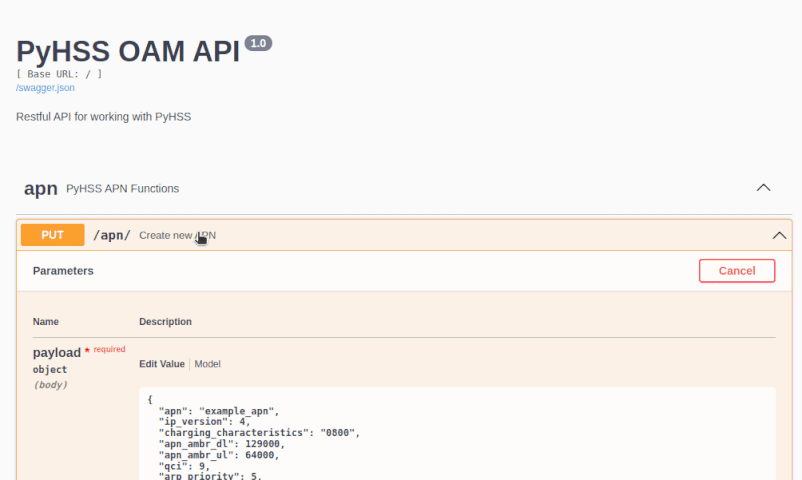

# PyHSS - API Service

A Flask-Restx based API service is available for all CRUD operations on the database.

You can start this by running:

```
export FLASK_APP=PyHSS_API.py
flask run --host=0.0.0.0 --port=8080
```

And browsing to ``http://hssip:8080/docs/``.

From here you'll get the Swagger based API docs with the "try it out" feature.

Note: When creating objects you do not need to set the ID field, for example when creating an API, you do not need to set the api_id - It is created for you.



For an example of using the API checkout `tests_API.py` which contains examples of working with the RESTful API in Python using the *requests* library.

From the API we can also do some funky things like seeing the Diameter peers connected to PyHSS, and manually triggering inserting Charging Rules to an Active Subscriber on the PyHSS PCRF.

An example systemd file is included in this directory (``API.service``) to run this as a service.

## Model

### Charging Rule 
| key                         | description                                                                                                            |
| --------------------------- | ---------------------------------------------------------------------------------------------------------------------- |
| rule_name                   | Name of the rule                                                                                                       |
| qci                         | QoS Class Identifiers                                                                                                  |
| arp_priority                | Bearer priority level (1-15)                                                                                           |
| arp_preemption_capability   | Capability to delete the other bearers.                                                                                |
| arp_preemption_vunerability | Capability to get deleted by other bearers.                                                                            |
| mbr_dl                      | Download maximum bit rate                                                                                              |
| mbr_ul                      | Upload maximum bit rate                                                                                                |
| gbr_dl                      | Download Guaranteed Bit Rate                                                                                           |
| gbr_ul                      | Upload Guaranteed Bit Rate                                                                                             |
| tft_group_id                | ID of the tft group (see tft)                                                                                          |
| precedence                  | determines the order, in which the service data flow templates are applied at service data flow detection at the PCEF. | 

### APN
| key                          | description                                                          |
| ---------------------------- | -------------------------------------------------------------------- |
| apn                          | Name of the APN                                                      |
| ip_version                   | 0: ipv4, 1: ipv6 2: ipv4+6 3: ipv4 or ipv6 [3GPP TS 29.272 7.3.62](https://www.etsi.org/deliver/etsi_ts/129200_129299/129272/08.10.00_60/ts_129272v081000p.pdf)   |
| pgw_address                  | IP of the PGW                                                        |
| sgw_address                  | IP of the SGW                                                        | 
| charging_rule_id             | Charging rule id see Charging Rule                                   |
| charging_characteristics     | For the encoding of this information element see 3GPP TS 32.298 [9]. |
| apn_ambr_dl                  | Download Aggregate Maximum Bit Rate                                  |
| apn_ambr_ul                  | Upload Aggregate Maximum Bit Rate                                    |
| qci                          | QoS Class Identifiers                                                |
| arp_priority                 | Bearer priority level (1-15)                                         |
| arp_preemption_capability    | Capability to delete the other bearers.                              |
| arp_preemption_vulnerebility | Capability to get deleted by other bearers.                          |

### AUC
| key | description                     |
| --- | ------------------------------- |
| ki  | Authentication Key              |
| opc | Network Operators key OPc       |
| amf | Authentication Management Field |
| sqn | Authentication sequence number  |

### Subscriber
| key                      | description                                                                                    |
| ------------------------ | ---------------------------------------------------------------------------------------------- |
| auc_id                   | Reference to AUC entry                                                                         |
| imsi                     | International mobile subscriber identity                                                       |
| enabled                  | Subscriber enabled/disabled                                                                    |
| apn_list                 | Comma seperated list of allowed APNs                                                           |
| msisdn                   | Phone number                                                                                   |
| ue_ambr_dl               | Download Aggregate Maximum Bit Rate                                                            |
| ue_ambr_ul               | Upload Aggregate Maximum Bit Rate                                                              |
| nam                      | Network Access Mode (default 0)                                                                |
| subscribed_rau_tau_timer | Periodic Tracking Area Update timer                                                            | 
| default_apn              | Default APN is used when the phone tries to attach without an APN (some Unisoc / MTK chipsets) |

### IMS Subscriber
| key         | description                                         |
| ----------- | --------------------------------------------------- |
| msisdn      | number uniquely identifying a subscription          |
| msisdn_list | list of numbers uniquely identifying a subscription |
| imsi        | International mobile subscriber identity            |
| ifc_path    | Path to file with the Initial Filter Criteria       |
| scscf       | Hostname of the SCSCF                               |

### TFT
| key          | description                                         | 
| ------------ | --------------------------------------------------- |
| tft_group_id | ID of the TFT group                                 |
| tft_string   | TFT String                                          |
| direction    | 0- Unspecified, 1 - Downlink, 2 - Uplink, 3 - Bidirectional |

### Equipment Identity Register

See [EIR](EIR.md)

### PCRF Dynamic Functions
| key              | description                                         | 
| ---------------- | --------------------------------------------------- |
| imsi             | International mobile subscriber identity            |
| apn_id           | ID of the entry in APN                              |
| charging_rule_id | ID of the entry in charging_rule                    |
